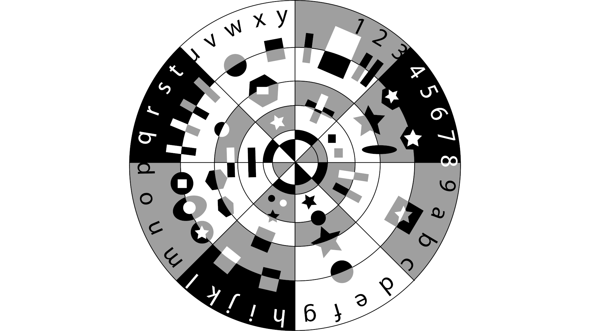
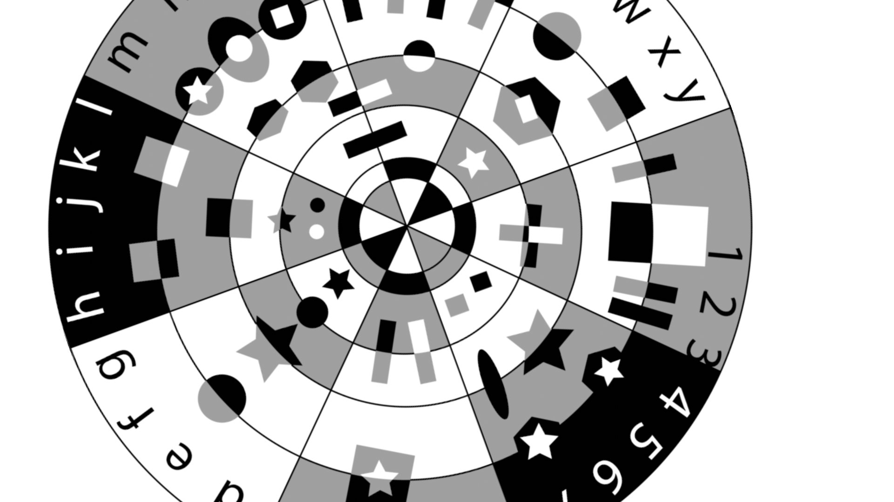
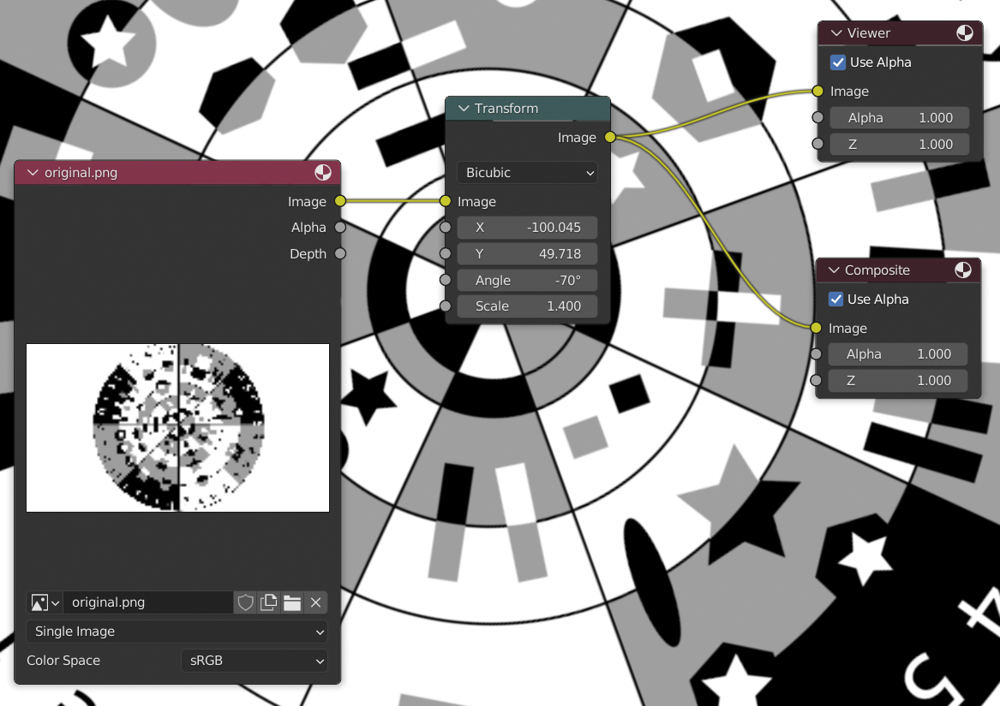

Image alignment
===============

Given two images, I wanted to recover the translation, rotation and scale needed to transform one into the other.

| Original | Transformed                      |
|----------|----------------------------------|
|  |  |

In my particular situation, I had some video footage that had been stabilized in Blender and I wanted to recover the transformation that had been applied to each frame in such a way that I could replicate the result of stabilization for a particular frame using a _Transform_ node:



In the end, I managed to do this using the [`estimateAffinePartial2D`](https://docs.opencv.org/4.5.5/d9/d0c/group__calib3d.html#gad767faff73e9cbd8b9d92b955b50062d) function in OpenCV and created the small Python script [`align_images.py`](align_images.py) found here.

Given the original and transformed images, the settings needed for the _Transform_ node can be recovered like this:

```
$ python align_images.py --original original.png --transform transformed.png 
Worst match distance: 20.0
Dimensions: 1920x1080

Transform node values:
* X: -99.859601
* Y: 49.416587
* Angle: -69.988642
* Scale: 1.399939
```

Setup
-----

In order to run `align_image.py`, OpenCV needs to be installed. You can set up a suitable environment as shown here:

```
$ python3 -m venv venv
$ source venv/bin/activate
(venv) $ pip install --upgrade pip
(venv) $ pip install opencv-python
Installing collected packages: numpy, opencv-python
Successfully installed numpy-1.22.3 opencv-python-4.5.5.64
```

As you can see above, installing `opencv-python` also triggers the installation of `numpy` - it does not need to be installed separately.

Now, `align_images.py` can be run as shown up above.

Notes
-----

The photogrammetry turntable image seen above can be found [here](https://coastalpaleo.blogspot.com/2020/06/photogrammetry-turntable-backgrounds.html) on the Coastal Paleo blog. Oddly though, the versions found on the blog are low-quality JPEG versions of larger high-quality PNGs that can be found with the Tweet [here](https://twitter.com/coastalpaleo/status/1276528937879904258) announcing the blog post.

Links that I found useful:

* MathWorks - [Find Image Rotation and Scale](https://www.mathworks.com/help/images/find-image-rotation-and-scale.html) 
* PyImageSearch - [Image alignment and registration with OpenCV](https://pyimagesearch.com/2020/08/31/image-alignment-and-registration-with-opencv/). This is very close to what I wanted but recovers a homology matrix rather than the similarity matrix that I wanted.
* This SO [answer](https://stackoverflow.com/a/54492463/245602) explains why one would use `estimateAffinePartial2D` rather than `estimateAffine2D` (the author of the answer mentions 5-degrees of freedom whereas the `estimateAffinePartial2D` documentation makes clear that it's just 4). This answer also uses `atan2` (rather than `atan` as commonly seen elsewhere) and after some googling, I think this is definitely the right function to be using.